# Culinary Coach

Culinary Coach is an AI-powered Flutter kitchen assistant that helps users decide what to cook, manage pantry ingredients, follow guided cooking steps, shop for missing items, and share recipes with a cooking community.

The app combines recipe discovery, ingredient filtering, voice support, grocery shopping, social features, and an admin dashboard in one mobile experience.

## Screenshots


<p align="center">
  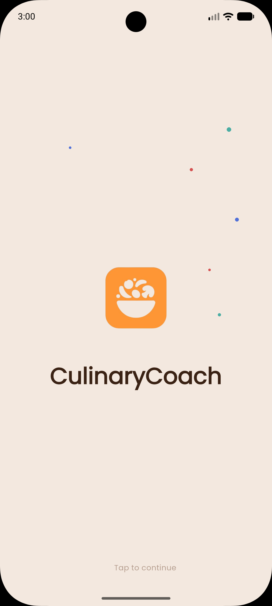
  &nbsp;&nbsp;&nbsp;
  &nbsp;&nbsp;&nbsp;
  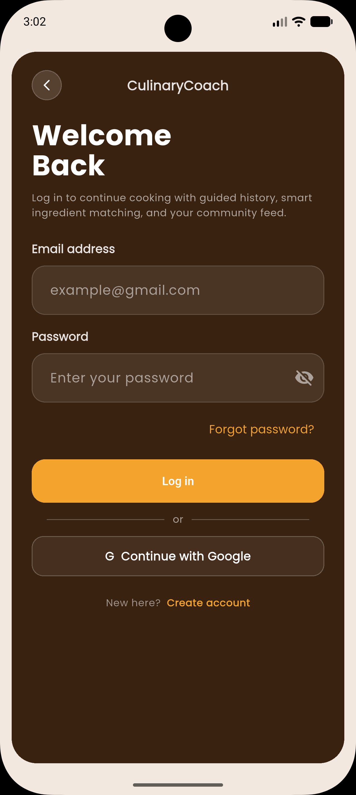
  &nbsp;&nbsp;&nbsp;
  &nbsp;&nbsp;&nbsp;
  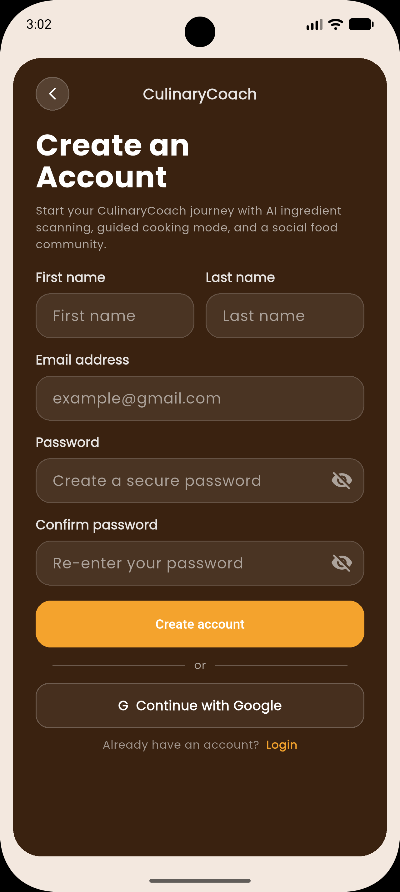
</p>

<p align="center">
  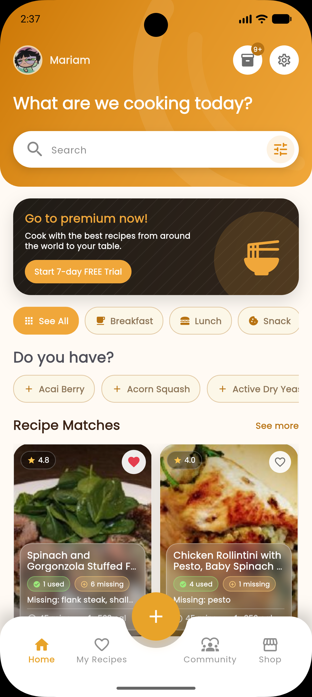
  &nbsp;&nbsp;&nbsp;
  &nbsp;&nbsp;&nbsp;
  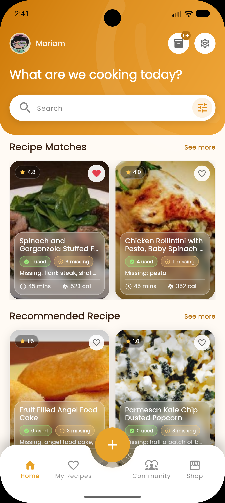
  &nbsp;&nbsp;&nbsp;
  &nbsp;&nbsp;&nbsp;
  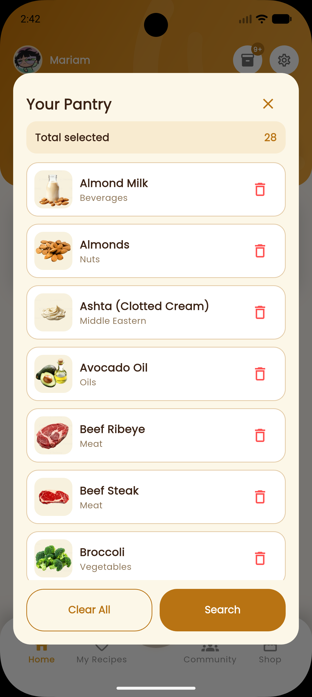
</p>

<p align="center">
  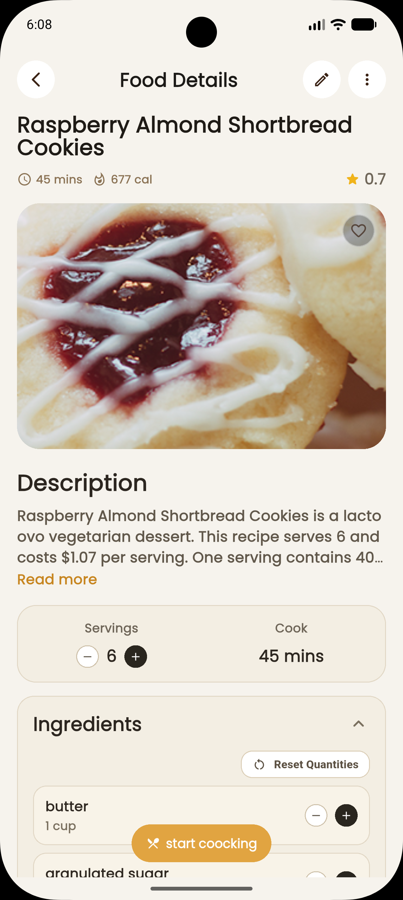
  &nbsp;&nbsp;&nbsp;
  &nbsp;&nbsp;&nbsp;
  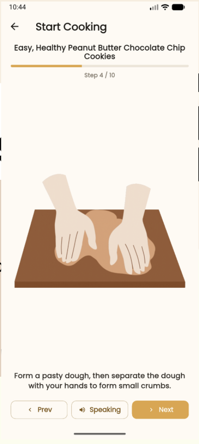
</p>


<p align="center">
  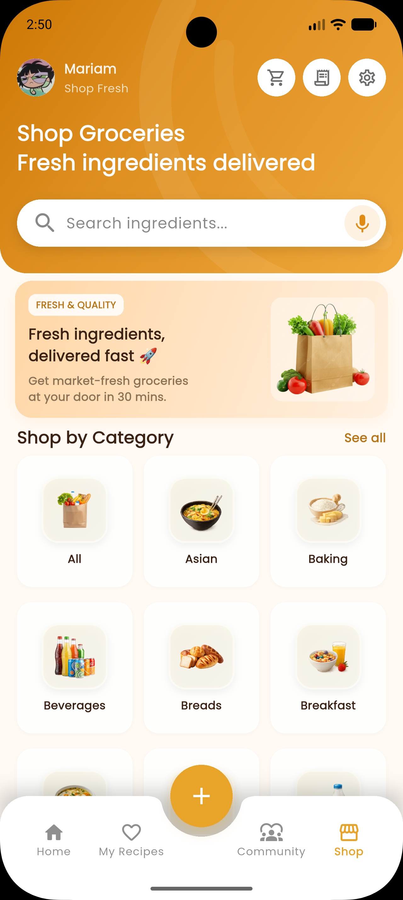
  &nbsp;&nbsp;&nbsp;
  &nbsp;&nbsp;&nbsp;
  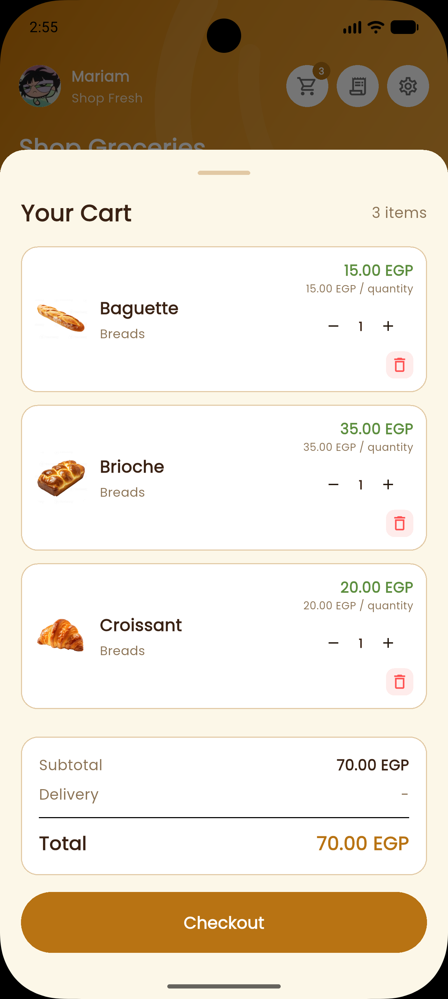
  &nbsp;&nbsp;&nbsp;
  &nbsp;&nbsp;&nbsp;
  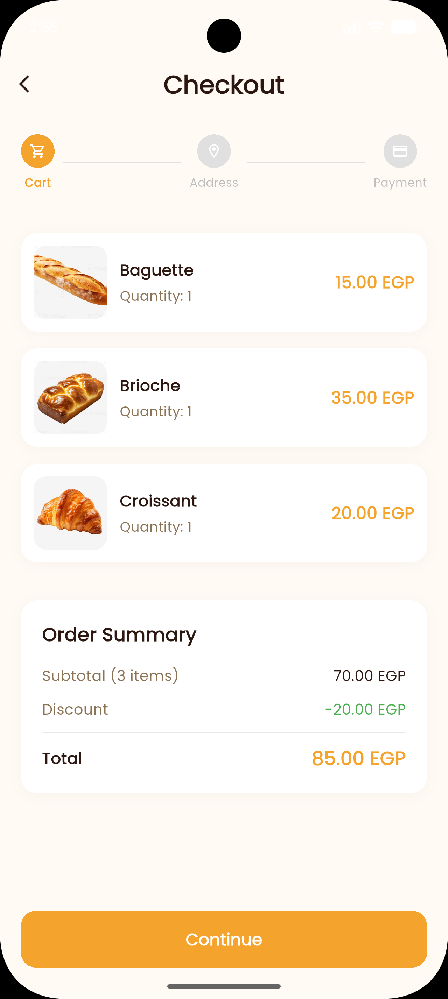
</p>

<p align="center">
  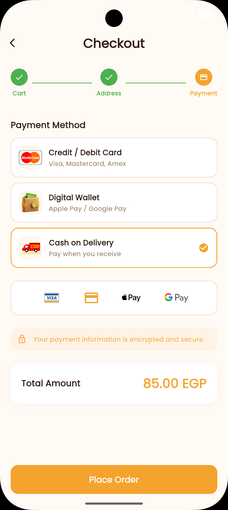
  &nbsp;&nbsp;&nbsp;
  &nbsp;&nbsp;&nbsp;
  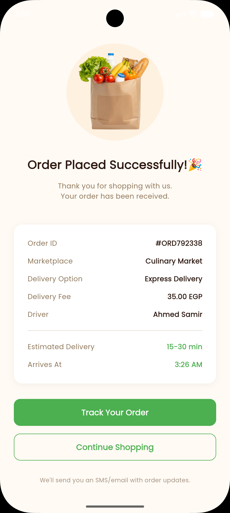
  &nbsp;&nbsp;&nbsp;
  &nbsp;&nbsp;&nbsp;
  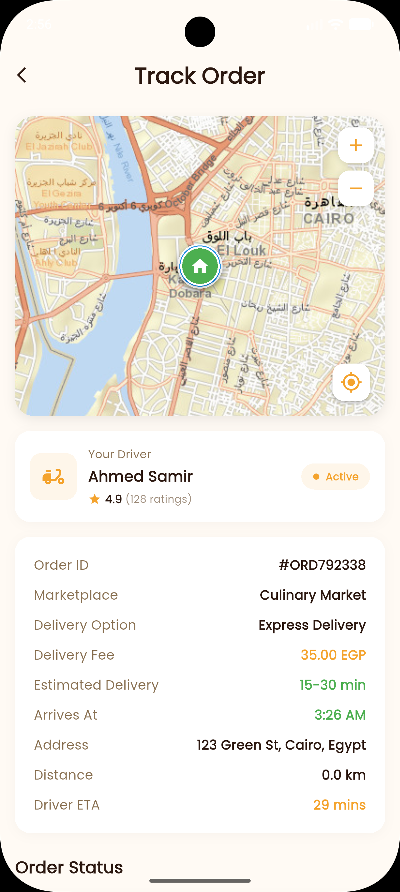
</p>

<p align="center">
   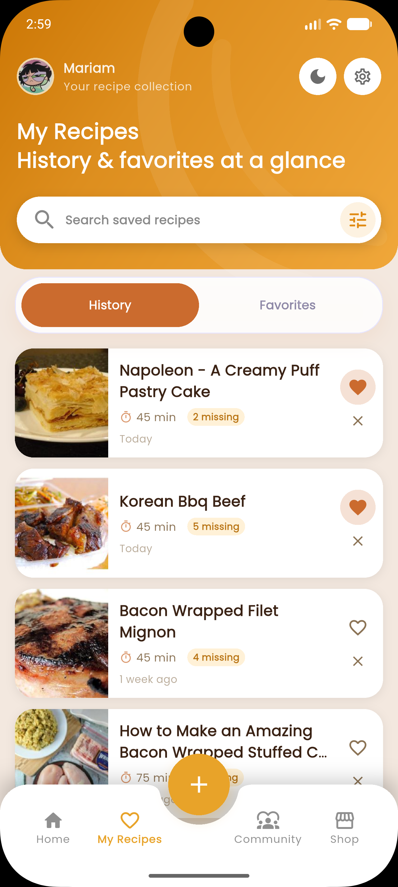
  &nbsp;&nbsp;&nbsp;
  &nbsp;&nbsp;&nbsp;
  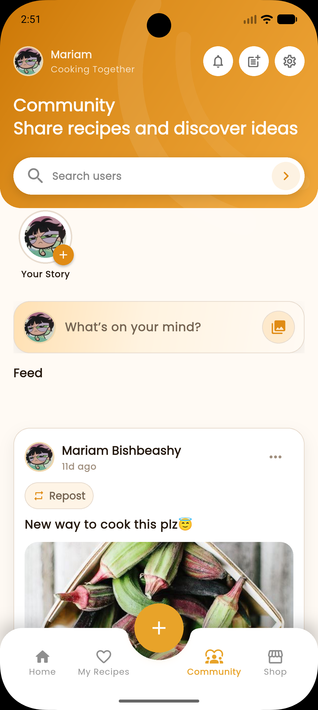
  &nbsp;&nbsp;&nbsp;
  &nbsp;&nbsp;&nbsp;
  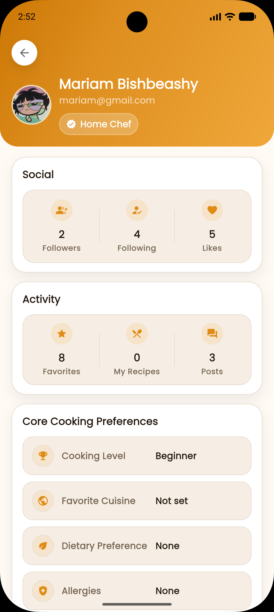
</p>

## Features

- Recipe recommendations based on selected pantry ingredients
- Recipe search, filters, sorting, ratings, cooking time, calories, and cuisine options
- Pantry ingredient manager with categories, quantities, image search, voice search, and scan support
- AI-assisted cooking steps using OpenAI, with cleaned instructions and matching cooking GIFs
- Text-to-speech cooking guidance with OpenAI voice and local Flutter TTS fallback
- Favorites and recipe history for saved recipes
- Grocery shop with categories, best sellers, cart, checkout, payment method UI, and order tracking
- Community feed with posts, comments, replies, stories, following, search, notifications, and profiles
- Firebase authentication with email/password and Google sign-in
- Admin dashboard for users, orders, drivers, ingredients, recipes, and platform statistics
- Light and dark mode support

## Tech Stack

- Flutter and Dart
- Firebase Core, Firebase Auth, Cloud Firestore, Firebase Storage, and Firebase App Check
- Riverpod for shared app state
- Spoonacular API for recipe discovery
- OpenAI API for cooking instruction cleanup and voice output
- Flutter Map, Geolocator, and Location for location-based flows
- Image Picker, Record, Audioplayers, Flutter TTS, and Cached Network Image

## Project Structure

```text
lib/
  app/                 App setup, routing, shell, and theme
  core/                Shared constants, utilities, and reusable widgets
  features/
    admin/             Admin dashboard and management screens
    auth/              Login, signup, Google sign-in, and auth services
    community/         Posts, comments, stories, profiles, and notifications
    filter/            Pantry ingredient selection, scanning, and voice search
    history/           Saved and previously viewed recipes
    home/              Recipe matching, discovery, details, and favorites
    onboarding/        First-run onboarding screens
    profile/           User profile and account management
    settings/          App settings, about, and privacy screens
    shop/              Grocery shop, cart, checkout, and order tracking
    start_cooking/     AI cooking step cleanup, media matching, and voice guidance
```

## Getting Started

### Prerequisites

Install the following before running the project:

- Flutter SDK
- Dart SDK
- Xcode for iOS builds
- Android Studio or Android SDK for Android builds
- Firebase CLI, if you need to regenerate Firebase configuration

### Installation

Clone the repository and install dependencies:

```bash
git clone <your-repository-url>
cd Culinary_Coach_App
flutter pub get
```

### Firebase Setup

This app uses Firebase Authentication, Cloud Firestore, Firebase Storage, and Firebase App Check.

To connect your own Firebase project:

1. Create a Firebase project in the Firebase Console.
2. Enable Email/Password and Google sign-in in Firebase Authentication.
3. Enable Cloud Firestore and Firebase Storage.
4. Configure your Android and iOS apps in Firebase.
5. Generate Firebase options with FlutterFire:

```bash
dart pub global activate flutterfire_cli
flutterfire configure
```

Make sure the generated Firebase configuration matches your Firebase project before running the app.

### API Keys

The app reads external API keys using Dart defines:

- `SPOONACULAR_API_KEY` for recipe search
- `OPENAI_API_KEY` for AI cooking steps and voice

Run the app with:

```bash
flutter run \
  --dart-define=SPOONACULAR_API_KEY=your_spoonacular_key \
  --dart-define=OPENAI_API_KEY=your_openai_key
```

If `OPENAI_API_KEY` is missing, cooking voice guidance falls back to local Flutter TTS where possible.

## Running The App

Run on a connected device or emulator:

```bash
flutter run
```

Run static analysis:

```bash
flutter analyze
```

Run tests:

```bash
flutter test
```

## Build

Android:

```bash
flutter build apk --release
```

iOS:

```bash
flutter build ios --release
```

## Notes

- Some features require a signed-in Firebase user.
- Recipe discovery depends on Spoonacular API availability and quota.
- AI cooking features depend on OpenAI API availability.

## License

This project was developed as a part of Mobile Device Programming course at Misr International University (MIU).
